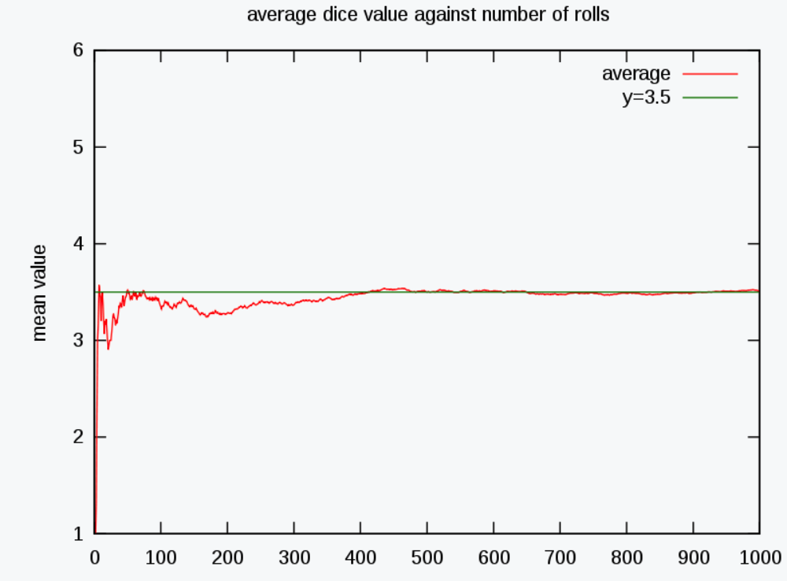

# 大数定律及中心极限定理

在数学与统计学中, 大数定律又称大数法则, 大数律, 是描述相当多次数重复实验的结果的定律. 根据这个定律知道, 样本数量越多, 则随机变量或其统计量的算术平均值就有越高的概率接近期望值. 

大数定律很重要, 因为它 "说明" 了一些随机事件的均值的长期稳定性. 人们发现, 在重复试验中, 随着试验次数的增加, 事件发生的频率趋于一个稳定值；人们同时也发现, 在对物理量的测量实践中, 测定值的算术平均也具有稳定性. 比如, 我们向上抛一枚硬币, 硬币落下后哪一面朝上是偶然的, 但当我们上抛硬币的次数足够多后, 达到上万次甚至几十万几百万次以后, 我们就会发现, 硬币每一面向上的次数约占总次数的二分之一, 亦即偶然之中包含着必然. 

上述现象是**切比雪夫不等式**的一个特殊应用情况, **辛钦定理**和**伯努利大数定律**也都概括了这一现象, 它们统称为大数定律. 

## 举例

例如, 抛掷一颗均匀的6面的骰子, 1, 2, 3, 4, 5, 6应等概率出现, 所以每次扔出骰子后, 出现点数的期望值是 ${\displaystyle {\frac {1+2+3+4+5+6}{6}}=3.5}$.

根据大数定理, 如果多次抛掷骰子, 随着抛掷次数的增加, 平均值 (样本平均值) 应该接近3.5, 根据大数定理, 在多次伯努利实验中, 实验概率最后收敛于理论推断的概率值, 对于伯努利随机变量, 理论推断的成功概率就是期望值, 而若对 n 个相互独立的随机变量的平均值, 频率越多则相对越精准. 

例如硬币投掷即伯努利实验, 当投掷一枚均匀的硬币, 理论上得出的正面向上的概率应是1/2. 因此, 根据大数定理, 正面朝上的比例在相对 "大" 的数字下,  "理应" 接近为1/2, 尤其是正面朝上的概率在n次实验 (n接近无限大时) 后应几近收敛到1/2. 

即使正面朝上 (或背面朝上) 的比例接近1/2, 几乎很自然的正面与负面朝上的绝对差值 (absolute difference差值范围) 应该相应随着抛掷次数的增加而增加. 换句话说, 绝对差值的概率应该是会随着抛掷次数而接近于0. 直观的来看, 绝对差值的期望会增加, 只是慢于抛掷次数增加的速度. 

如上, 以特定掷单个骰子的过程来展示大数定律. 随着投掷次数的增加, 所有结果的均值趋于3.5 (骰子点数的期望值) . 不同时候做的这个实验会在投掷次数较小的时候 (左部) 会表现出不同的形状, 当次数变得很大 (右部) 的时候, 它们将会非常相似. 

## 表现形式

大数定律主要有两种表现形式: 弱大数定律和强大数定律. 定律的两种形式都肯定无疑地表明, 样本均值 ${\overline {X}}_{n}={\frac {1}{n}}(X_{1}+\cdots +X_{n})$ 收敛于真值 ${\displaystyle {\overline {X}}_{n}\to \mu \quad {\textrm {as}}\quad n\to \infty }$.

其中 $X_1, X_2$, ... 是独立同分布, 期望值 ${\displaystyle \operatorname {E} (X_{1})=\operatorname {E} (X_{2})=\,\cdots \,=\mu }$ 且皆勒贝格可积的随机变量构成的无穷序列. $X_j$ 的勒贝格可积性意味着期望值 ${\displaystyle \operatorname {E} (X_{j})}$ 存在且有限. 

方差 ${\displaystyle \operatorname {Var} (X_{1})=\operatorname {Var} (X_{2})=\,\cdots \,=\sigma ^{2}<\infty }$ 有限的假设是非必要的. 很大或者无穷大的方差会使其收敛得缓慢一些, 但大数定律仍然成立. 通常采用这个假设来使证明更加简洁. 

强和弱之间的差别在所断言的收敛的方式. 对于这些方式的解释, 参见随机变量的收敛. 

### 弱大数定律

弱大数定律也称为**辛钦定理**, 陈述为: 样本均值依概率收敛于期望值. 

$${\displaystyle {\overline {X}}_{n}\ {\xrightarrow {P}}\ \mu \quad {\textrm {as}}\quad n\to \infty }$$

也就是说对于任意正数 ε,

$${\displaystyle \lim _{n\to \infty }P\left(\,|{\overline {X}}_{n}-\mu |>\varepsilon \,\right)=0}$$

### 强大数定律

强大数定律指出, 样本均值以概率 1 收敛于期望值. 

$${\displaystyle {\overline {X}}_{n}\ {\xrightarrow {\text{a.s.}}}\ \mu \quad {\textrm {as}}\quad n\to \infty }$$
即

$${\displaystyle P\left(\lim _{n\to \infty }{\overline {X}}_{n}=\mu \right)=1}$$

#### 切比雪夫定理的特殊情况

设${\displaystyle a_{1},\ a_{2},\ \dots \ ,\ a_{n},\ \dots }$ 为相互独立的随机变量, 其数学期望为: ${\displaystyle \operatorname {E} (a_{i})=\mu \quad (i=1,\ 2,\ \dots )}$, 方差为: ${\displaystyle \operatorname {Var} (a_{i})=\sigma ^{2}\quad (i=1,\ 2,\ \dots )}$

则序列 ${\displaystyle {\overline {a}}={\frac {1}{n}}\sum _{i=1}^{n}a_{i}}$依概率收敛于 $\mu$  (即收敛于此数列的数学期望 $E(a_{i})$) . 

换言之, 在定理条件下, 当 n 无限变大时, n 个随机变量的算术平均将变成一个常数. 

#### 伯努利大数定律

设在 n 次独立重复伯努利试验中, 事件 $X$ 发生的次数为 $n_{x}$, 事件 $X$ 在每次试验中发生的总体概率为 $p$, $ {\displaystyle {\frac {n_{x}}{n}}}$ 代表样本发生事件 $X$ 的频率. 

则对任意正数 $\varepsilon >0$ , 伯努利大数定律表明: 

$${\displaystyle \lim _{n\to \infty }{P{\left\{\left|{\frac {n_{x}}{n}}-p\right|<\varepsilon \right\}}}=1}$$

换言之, 事件发生的频率依概率收敛于事件的总体概率. 该定理以严格的数学形式表达了频率的稳定性, 也就是说当 n 很大时, 事件发生的频率于总体概率有较大偏差的可能性很小. 

# 中心极限定理

## 总体分布服从正态分布

任意一个样本, 无论样本容量多大, 样本均值的抽样分布都服从正态分布. 

## 总体不服从正态分布

只要样本容量足够 $n>30$, 即使总体不服从正态分布, 样本均值的抽样分布也会近似服从正态分布. 
