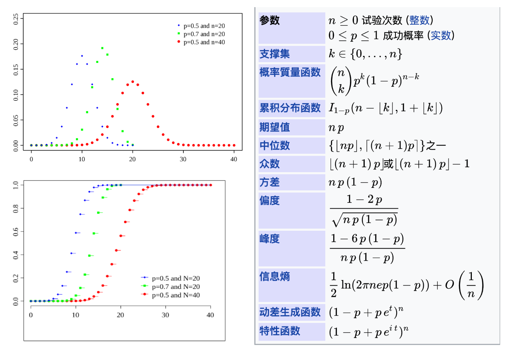
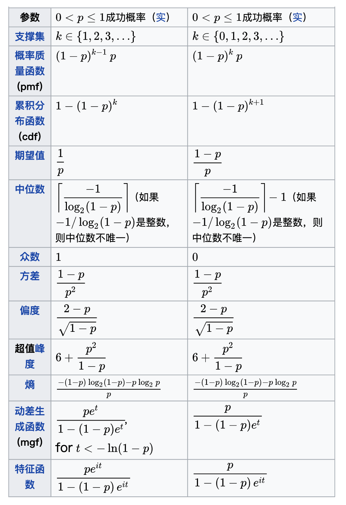
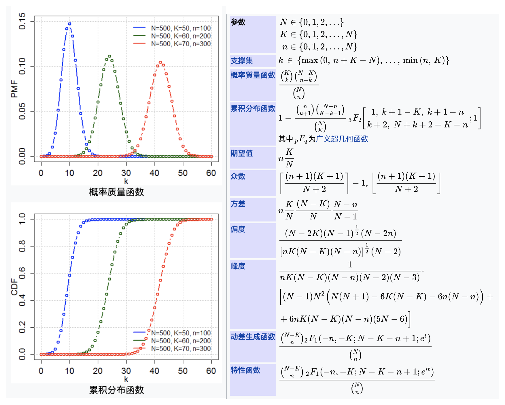
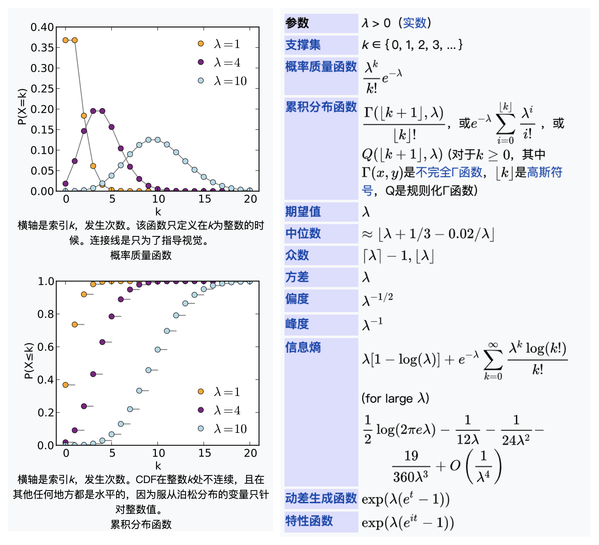
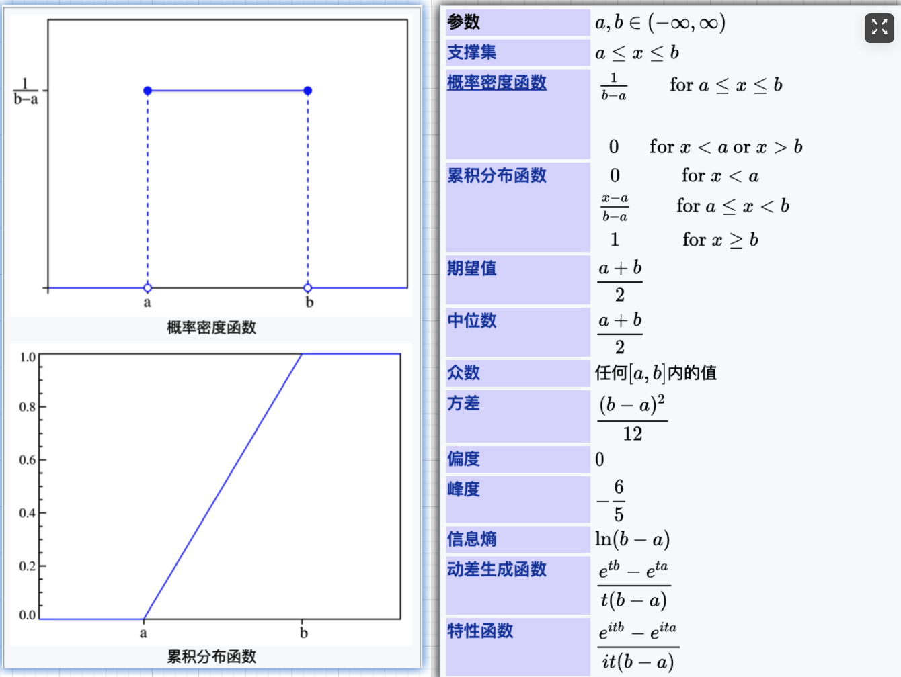
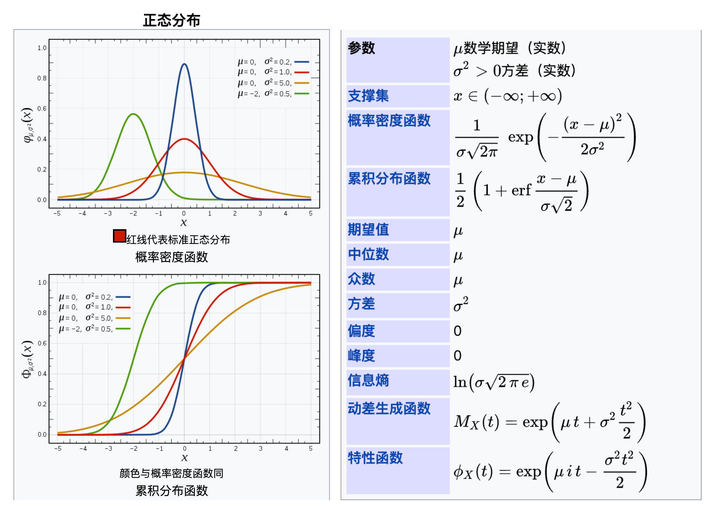

# 随机变量及其分布

# 随机试验

**随机试验**是[概率论](https://zh.wikipedia.org/wiki/%E6%A6%82%E7%8E%87%E8%AE%BA)的一个基本概念。 概括地讲，在[概率论](https://zh.wikipedia.org/wiki/%E6%A6%82%E7%8E%87%E8%AE%BA)中把符合下面三个特点的试验叫做随机试验：

1. 可以在相同的条件下重复的进行。
2. 每次试验的可能结果不止一个，并且能事先明确试验的所有可能结果。
3. 进行一次试验之前不能确定哪一个结果会出现。

随机试验通常用 $$E$$（event）表示：

_$$E$$_ ：抛1颗骰子，观察出现的点数情况。

# 样本空间

随机试验 $$E$$ 的所有可能结果组成的集合成为 $$E$$ 的**样本空间**，记为 $$S$$。

样本空间的元素，即E的每个结果，成为**样本点**。

$$S$$= {点1, 点2, 点3, 点4, 点5, 点6}

点 1 到点 6 均为样本点。

# 随机事件

随机试验 $$E$$ 的样本空间 $$S$$ 的子集为 $$E$$ 的**随机事件**，在每次试验中，当且仅当这一子集中的一个样本点出现时，称这一**事件发生**。由一个样本点组成的单点集，成为**基本事件**。$$S$$ 本身成为**必然事件**。$$∅$$ 不包含任何样本点，成为**不可能事件**。

$$A_1$$：抛 1 颗骰子，出现的点数大于 3。

# 随机变量

设随机试验的样本空间为 $$S=\left\{ e \right\}$$，$$X=X\left( e \right)$$ 是定义在样本空间上的实值单值函数，则称 $$X$$ 为随机变量。一般以大写字母 $$X，Y，Z$$ 等表示随机变量，而以小写字母 $$x，y，z$$ 等表示实数。随机变量的取值随试验的结果而定，在试验之前不能预知取值，且它的取值有一定的概率。

随机变量有**离散型**和**连续型**：

离散型随机变量有其**分布律**；

连续型随机变量可以满足一定**分布**。

$$X$$ 为点数对应的数字：$$X=1, 2, 3, 4, 5, 6$$，离散型

$$A1：X>3$$

$$P\left( X>3 \right) =\frac { 1 }{ 2 }$$

# 离散型随机变量分布律

## 0-1分布
**伯努利分布**（英语：Bernoulli distribution,_ _又名**两点分布**或者**0-1分布, **是一个[离散型概率分布](https://zh.wikipedia.org/wiki/%E6%A6%82%E7%8E%87%E5%88%86%E5%B8%83#%E7%A6%BB%E6%95%A3%E5%88%86%E5%B8%83), 为纪念瑞士科学家[雅各布·伯努利](https://zh.wikipedia.org/wiki/%E9%9B%85%E5%90%84%E5%B8%83%C2%B7%E4%BC%AF%E5%8A%AA%E5%88%A9)而命名). 若伯努利试验成功, 则伯努利随机变量取值为1. 若伯努利试验失败, 则伯努利随机变量取值为0. 记其成功概率为$${\displaystyle p(0{\leq }p{\leq }1)}$$, 失败概率为 $${\displaystyle q=1-p}$$.

- 其[概率密度函数](https://zh.wikipedia.org/wiki/%E6%A6%82%E7%8E%87%E8%B4%A8%E9%87%8F%E5%87%BD%E6%95%B0)为:

$${\displaystyle f_{X}(x)=p^{x}(1-p)^{1-x}=\left\{{\begin{matrix}p&{\mbox{if }}x=1,\\q\ &{\mbox{if }}x=0.\\\end{matrix}}\right.}$$

- 其[期望值](https://zh.wikipedia.org/wiki/%E6%9C%9F%E6%9C%9B%E5%80%BC)为:

        $${\displaystyle \operatorname {E} [X]=\sum _{i=0}^{1}x_{i}f_{X}(x)=0+p=p}$$

- 其[方差](https://zh.wikipedia.org/wiki/%E6%96%B9%E5%B7%AE)为:

        $${\displaystyle \operatorname {var} [X]=\sum _{i=0}^{1}(x_{i}-E[X])^{2}f_{X}(x)=(0-p)^{2}(1-p)+(1-p)^{2}p=p(1-p)=pq}$$
## 二项分布
在概率论和统计学中, 二项分布 (英语：Binomial distribution）是n个独立的是/非试验中成功的次数的离散概率分布，其中每次试验的成功概率为p。这样的单次成功/失败试验又称为伯努利试验。实际上，当n = 1时，二项分布就是伯努利分布。二项分布是显著性差异的二项试验的基础。

下图左边两张图分别为**概率密度函数**与**累积分布函数**:

## 几何分布
在概率论和统计学中，几何分布（英语：Geometric distribution）指的是以下两种离散型概率分布中的一种：

在伯努利试验中，得到一次成功所需要的试验次数 X。X的值域是{ 1, 2, 3, ... }
在得到第一次成功之前所经历的失败次数Y = X − 1。Y的值域是{ 0, 1, 2, 3, ... }
实际使用中指的是哪一个取决于惯例和使用方便。

这两种分布不应该混淆。前一种形式（X的分布）经常被称作shifted geometric distribution；但是，为了避免歧义，最好明确地说明取值范围。

如果每次试验的成功概率是p，那么k次试验中，第k次才得到成功的概率是，

$${\displaystyle \Pr(X=k)=(1-p)^{k-1}\,p\,}\Pr(X=k)=(1-p)^{{k-1}}\,p\,$$

其中 k = 1, 2, 3, ....

上式描述的是取得一次成功所需要的试验次数。而另一种形式，也就是第一次成功之前所失败的次数，可以写为，

$${\displaystyle \Pr(Y=k)=(1-p)^{k}\,p\,}{\displaystyle \Pr(Y=k)=(1-p)^{k}\,p\,}$$

其中k = 0, 1, 2, 3, ....

两种情况产生的序列都是几何数列。

比如，假设不停地掷骰子，直到得到1。投掷次数是随机分布的，取值范围是无穷集合{ 1, 2, 3, ... }，并且是一个p = 1/6的几何分布。

## 超几何分布
超几何分布是统计学上一种离散概率分布。它描述了由有限个物件中抽出 n 个物件，成功抽出指定种类的物件的个数（不归还 （without replacement））。

例如在有 N 个样本，其中 K 个是不及格的。超几何分布描述了在该 N 个样本中抽出 n 个，其中 k 个是不及格的几率：

$${\displaystyle f(k;n,K,N)={{{K \choose k}{{N-K} \choose {n-k}}} \over {N \choose n}}}$$

上式可如此理解：$${\displaystyle {\tbinom {N}{n}}}$$ 表示所有在 N 个样本中抽出 n 个的方法数目。$${\displaystyle {\tbinom {K}{k}}}$$ 表示在 K 个样本中，抽出 k 个的方法数目，即组合数，又称二项式系数。剩下来的样本都是及格的，而及格的样本有 $${\displaystyle N-K}$$ 个，剩下的抽法便有 $${\displaystyle {\tbinom {N-K}{n-k}}}$$ 种。

若 n=1，超几何分布还原为伯努利分布。

**记号**

若随机变量 X 服从参数为 $${\displaystyle n,K,N}$$ 的超几何分布，则记为 $${\displaystyle X\sim H(n,K,N)}$$。

## 泊松分布
泊松分布（法语：loi de Poisson，英语：Poisson distribution）又称帕松分布、普阿松分布、布瓦松分布、布阿松分布、波以松分布、卜氏分配、泊松小数法则（Poisson law of small numbers），是一种统计与概率学里常见到的离散概率分布，由法国数学家西莫恩·德尼·泊松在1838年时发表。

泊松分布适合于描述单位时间内随机事件发生的次数的概率分布。如某一服务设施在一定时间内受到的服务请求的次数，电话交换机接到呼叫的次数、汽车站台的候客人数、机器出现的故障数、自然灾害发生的次数、DNA序列的变异数、放射性原子核的衰变数、激光的光子数分布等等。

泊松分布的概率质量函数为：

$${\displaystyle P(X=k)={\frac {e^{-\lambda }\lambda ^{k}}{k!}}}$$

泊松分布的参数λ是单位时间（或单位面积）内随机事件的平均发生率。

# 连续型随机变量的分布

分布函数、概率密度函数、随机变量的函数的分布

## 均匀分布
连续型均匀分布，如果连续型随机变量 $${\displaystyle {\mathit {X}}}$$ 具有如下的概率密度函数，则称 $${\displaystyle {\mathit {X}}}$$ 服从 $${\displaystyle [a,b]}$$ 上的均匀分布（uniform distribution）,记作$${\displaystyle X\sim U[a,b]}$$

一个均匀分布在区间 [a,b] 上的连续型随机变量 $${\displaystyle X}$$ 可给出如下函数：

**概率密度函数：**

$${\displaystyle f(x)=\left\{{\begin{matrix}{\frac {1}{b-a}}&\ \ \ {\mbox{for }}a\leq x\leq b\\0&{\mbox{elsewhere}}\end{matrix}}\right.}$$

**累积分布函数：**

$${\displaystyle F(x)=\left\{{\begin{matrix}0&{\mbox{for }}x<a\\{\frac {x-a}{b-a}}&\ \ \ {\mbox{for }}a\leq x<b\\1&{\mbox{for }}x\geq b\end{matrix}}\right.}$$

## 指数分布
在概率论和统计学中，指数分布（英语：Exponential distribution）是一种连续概率分布。指数分布可以用来表示独立随机事件发生的时间间隔，比如旅客进入机场的时间间隔、打进客服中心电话的时间间隔、中文维基百科新条目出现的时间间隔等等。

**概率密度函数**
一个指数分布的概率密度函数是：

$${\displaystyle f(x;\lambda )=\left\{{\begin{matrix}\lambda e^{-\lambda x}&,\;x\geq 0,\\0&,\;x<0.\end{matrix}}\right.}$$

其中λ > 0是分布的一个参数，常被称为率参数（rate parameter）。即每单位时间发生该事件的次数。指数分布的区间是[0,∞)。 如果一个随机变量X 呈指数分布，则可以写作：X ~ Exponential（λ）。

**累积分布函数**
累积分布函数可以写成：

$${\displaystyle F(x;\lambda )=\left\{{\begin{matrix}1-e^{-\lambda x}&,\;x\geq 0,\\0&,\;x<0.\end{matrix}}\right.}$$

## 正态分布
正态分布（台湾作常态分布，英语：normal distribution）又名高斯分布（英语：Gaussian distribution），是一个非常常见的连续概率分布。正态分布在统计学上十分重要，经常用在自然和社会科学来代表一个不明的随机变量。[1][2]

若随机变量 X 服从一个位置参数为 $$\mu$$ 、尺度参数为 $$\sigma$$ 的正态分布，记为：

$${\displaystyle X\sim N(\mu ,\sigma ^{2}),}$$

则其概率密度函数为:

$${\displaystyle f(x)={\frac {1}{\sigma {\sqrt {2\pi }}}}\;e^{-{\frac {\left(x-\mu \right)^{2}}{2\sigma ^{2}}}}\!}$$

正态分布的数学期望值或期望值 $$\mu$$ 等于位置参数，决定了分布的位置；其方差 $$\sigma^2$$ 的开平方或标准差 $$\sigma$$

正态分布的概率密度函数曲线呈钟形，因此人们又经常称之为钟形曲线（类似于寺庙里的大钟，因此得名）。我们通常所说的标准正态分布是位置参数 $$\mu =0$$，尺度参数 $$\sigma^2 = 1$$ 的正态分布（见下图中红色曲线）.

